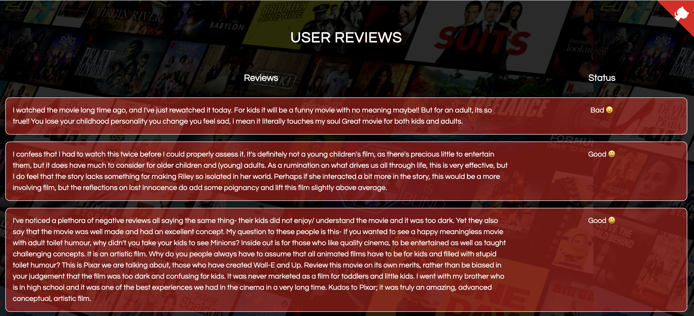

# **Movie Recommender System**

## Overview

Content Based Recommender System recommends movies similar to the movie user likes and analyses the sentiments on the reviews given by the user for that movie.

The details of the movies(title, genre, runtime, rating, poster, etc) are fetched using an API by TMDB, https://www.themoviedb.org/documentation/api, and using the IMDB id of the movie in the API. 

*Web scraping* is used to get the reviews given by the user in the IMDB site using beautifulsoup4 and sentiment analysis is performed on those reviews.

## Running the application

To run the application, clone this repository and run the following command

```bash
  python main.py
```

## Demo



